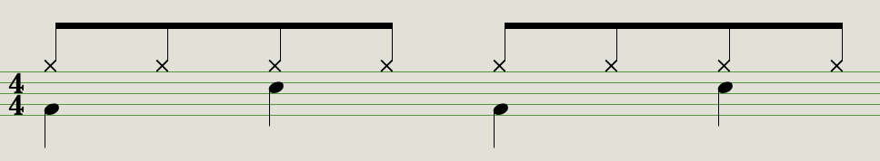
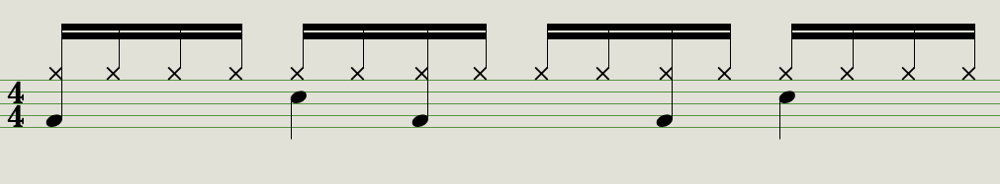

# The Music
## The Beats
### Boom-bap vs. trap
In the Korean community, hip-hop has traditionally been divided into two subgenres: "**boom-bap**" and "**trap**". The primary difference is in instrumentation and tempo: boom-bap uses acoustic drums typically at 72-96BPM, subdividing each beat twice with the hi-hat; trap uses synthesized drums and has a broader tempo range (60-102BPM) while the hi-hat plays sixteenth notes embellished with further subdivisions.

<figure>

<figcaption align = "center">Typical drum patterns for boom-bap(left) and trap(right).</figcaption>
</figure>

Boom-bap is associated with "traditional hip-hop" focused on lyrics and technique; the rappers regarded as the most "skillful" typically lean towards boom-bap over trap. Boom-bap production often incoporates elements of jazz, funk, and rock, and makes frequent use of sampling.

Trap music hit the American mainstream in the late 2000s, and it wasn't long before Korean artists followed suit – most influentially **Okasian**'s 2012 album _탑승수속_ and the 2014 **Illionaire Records** release _11:11_. Trap is associated with braggadocio – songs about success, drugs, sex, and partying – exuding an aura that made the style instantly appeal to younger artists, especially ones that philosophically or stylistically didn't align with boom-bap. Musically speaking, trap is easily identified by a deep 808 bass and synthesized instruments, in addition to the drum pattern mentioned above.




# THE REST OF THIS PAGE IS STILL UNDER CONSTRUCTION SORRY

### The newest trends: emo rap and drill

## The Vocals
### Verbal Jint and multisyllabic rhyme
### Melodic rap
## Hip-hop and Other Genres